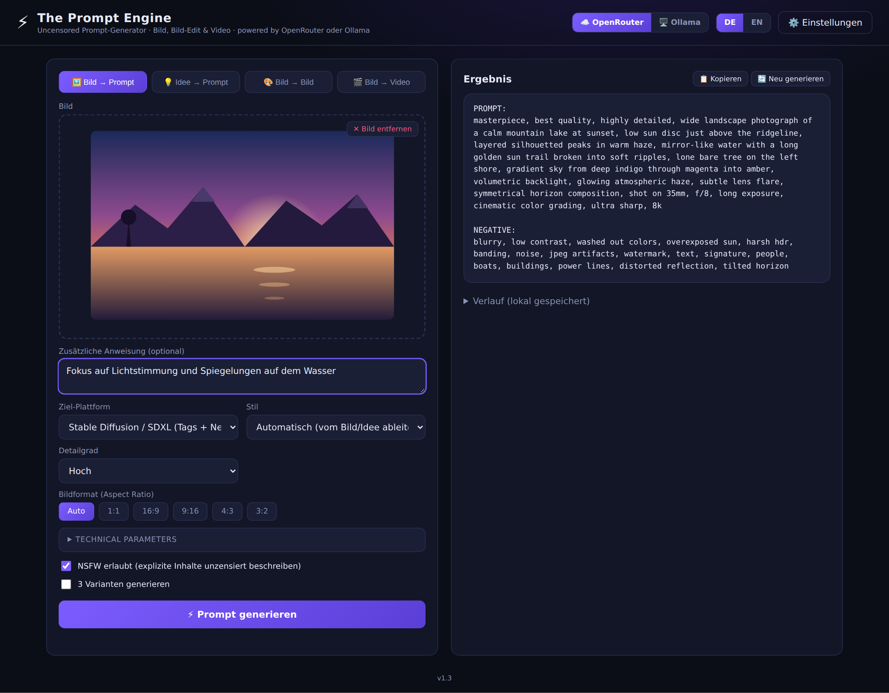
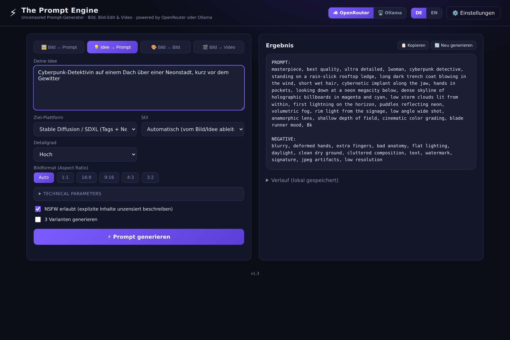
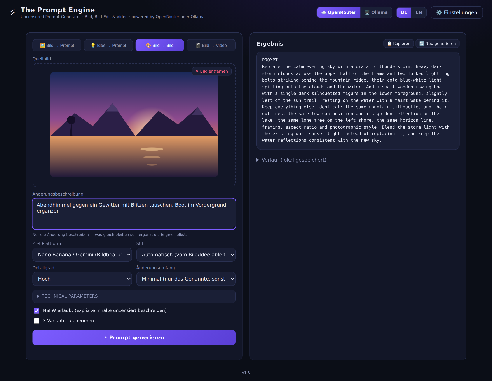
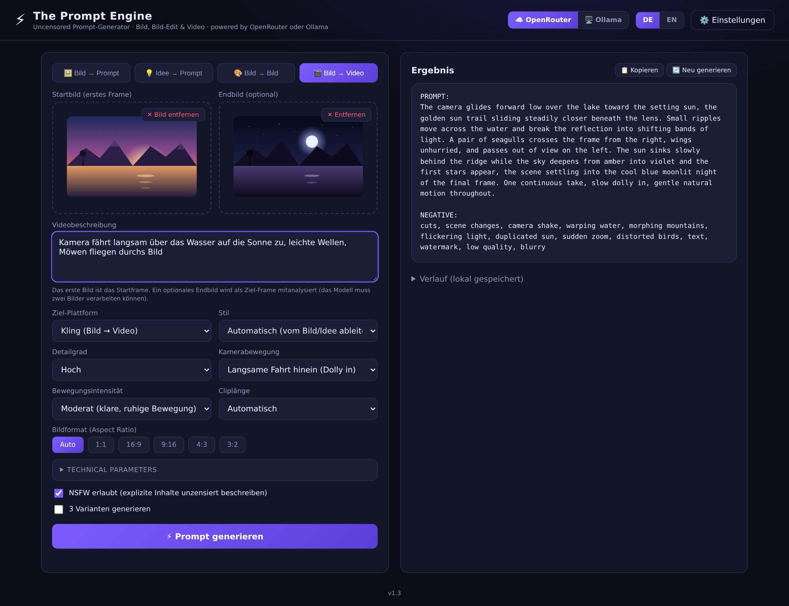

# ⚡ The Prompt Engine — Uncensored (OpenRouter- & Ollama-Edition)

*[English version](README.md)*

Funktionaler Nachbau von *thepromptengine.midnightlabai.com* — ohne dessen Kernfehler:
Das Original hatte `gemini-2.5-flash` fest im Frontend-Bundle verdrahtet; nachdem Google
das Modell für neue API-Konten abgeschaltet hat, lief jeder neue Key auf einen 404.

Dieser Klon nutzt stattdessen **frei wählbare Vision-Modelle** — kein Modell ist
hartkodiert, die Modellliste wird zur Laufzeit geladen. Umschaltbar zwischen zwei
Anbietern:

- **OpenRouter** (Cloud) — riesiger Modellkatalog, API-Key nötig, kostet pro Anfrage.
- **Ollama** (lokal) — läuft auf dem eigenen Rechner: kein API-Key, keine Kosten,
  keine Bilder verlassen den Rechner.

Der Umschalter sitzt oben rechts in der Kopfzeile (☁️ OpenRouter / 🖥️ Ollama) und
zusätzlich in den ⚙️ Einstellungen. Modell, API-Key und Ollama-Adresse werden je
Anbieter getrennt gespeichert — ein Wechsel verliert also keine Einstellung.

## Features

- **Bild → Prompt**: Bild hochladen (Drag & Drop, Klick oder Strg+V), ein Vision-LLM
  analysiert es und erzeugt einen detaillierten Generierungs-Prompt.
- **Idee → Prompt**: Kurze Idee eingeben, die Engine baut daraus einen Profi-Prompt.
- **Bild → Bild**: Quellbild hochladen und in Worten beschreiben, was daran geändert
  werden soll — heraus kommt ein fertiger Edit-Prompt für Bildbearbeitungs-Modelle.
  Der **Änderungsumfang** (minimal / moderat / stark) steuert, wie viel sich neben
  der gewünschten Änderung mitverändern darf; bei „minimal“ schreibt die Engine die
  zu erhaltenden Eigenschaften (Identität, Pose, Hintergrund, Licht, Bildausschnitt)
  ausdrücklich in den Prompt.
- **Bild → Video**: Startbild hochladen, optional ein **Endbild** als Ziel-Frame, dazu
  beschreiben, was im Clip passieren soll — heraus kommt ein Image-to-Video-Prompt.
  Zusätzlich einstellbar: Kamerabewegung (Dolly, Schwenk, Orbit, Kranfahrt, Handkamera
  …), Bewegungsintensität (dezent / moderat / dynamisch) und Cliplänge.
- **Ziel-Plattformen** je Modus:
  - *Bild/Idee → Prompt*: SDXL (Tags + Negative Prompt), Pony/Illustrious (Booru-Tags
    inkl. score-/rating-Tags), Flux (Fließtext), Midjourney (inkl. `--ar`/`--stylize`),
    DALL-E, Ideogram, Nano Banana/Gemini, Qwen-Image (mit Text-Rendering), Krea 2
    (fotorealistisch), Z-Image Turbo (ohne Negative Prompt), universell.
  - *Bild → Bild*: Nano Banana/Gemini, Flux.1 Kontext, Qwen-Image-Edit,
    Seedream/SeedEdit, GPT-Image/DALL-E Edit, SD/SDXL img2img + Inpainting (mit
    Denoise-Empfehlung und Maskenbereich), universell.
  - *Bild → Video*: Kling, Runway Gen-4, Google Veo 3 (mit Ton-Beschreibung),
    Hailuo/MiniMax, Luma Dream Machine/Ray, Wan 2.2, Sora 2, Seedance, universell.
- **Bildformate**: Aspect-Ratio-Auswahl wie im Original (Auto, 1:1, 16:9, 9:16, 4:3,
  3:2) — bei Midjourney als `--ar`, bei SDXL/Pony mit passender Auflösungsempfehlung.
  Im Modus **Bild → Bild** entfällt die Auswahl: dort gibt das Quellbild das Format vor.
- **Technical Parameters** (wie im Original, ausklappbar): Logic Mode, Camera Angle,
  Shot Type, Perspective, Composition, Lighting, Atmosphere, Mood, Emotion — jeweils
  mit denselben Wertelisten wie Midnight LAB v2.0.
- **Zweisprachig**: Sprachumschalter (DE/EN) oben rechts, Auswahl wird gespeichert.
- **Optionen**: Stil-Vorgabe, Detailgrad, 3-Varianten-Modus, Streaming-Ausgabe,
  Kopier-Button, lokaler Verlauf.
- **Unzensiert**: NSFW-Schalter — explizite Bilder werden direkt und ohne Umschreibungen
  analysiert. Empfohlene Standard-Modelle (Qwen3-VL-Familie) laufen auf unmoderierten
  OpenRouter-Endpoints; lokal via Ollama entscheidet ohnehin nur das Modell selbst.
  Harte Grenzen bleiben immer aktiv: keine Darstellungen Minderjähriger, keine
  sexuellen Inhalte realer, identifizierbarer Personen.
- **Kein Backend**: Reines statisches Frontend. Der API-Key bleibt im localStorage des
  Browsers und geht ausschließlich direkt an `openrouter.ai` — bzw. bei Ollama an den
  eigenen Rechner.

## Screenshots

Die vier Modi in der Oberfläche. Quellbilder, Eingaben und Ergebnisse sind
Beispiele zur Illustration — die Prompts erzeugt im Betrieb das gewählte Modell.

### 🖼️ Bild → Prompt

Bild hochladen, optional eine Zusatzanweisung — heraus kommt ein
Generierungs-Prompt im Format der gewählten Ziel-Plattform (hier SDXL mit
Negative Prompt).



### 💡 Idee → Prompt

Ohne Bild: Eine kurze Idee genügt, die Engine baut daraus den vollständigen
Prompt. Der Bildbereich entfällt, alle übrigen Optionen bleiben.



### 🎨 Bild → Bild

Quellbild plus Änderungsbeschreibung ergeben einen Edit-Prompt. Zusätzlich gibt
es hier den **Änderungsumfang**; die Bildformat-Auswahl entfällt, weil das
Quellbild das Format vorgibt.



### 🎬 Bild → Video

Startbild, optionales Endbild als Ziel-Frame und die Videobeschreibung; dazu
Kamerabewegung, Bewegungsintensität und Cliplänge.



## Nutzung

1. Seite starten:
   - **Windows**: `start.bat` doppelklicken. Das Skript prüft, ob Ollama läuft,
     startet es bei Bedarf, sucht sich einen freien Port, startet den Server im
     richtigen Ordner und öffnet den Browser.
   - **macOS / Linux**: `python3 serve.py` im Projektordner — macht dasselbe.
   - Ohne die Ollama-Prüfung: `start.bat --no-ollama` bzw. `python3 serve.py --no-ollama`.
   - **Von Hand**: `python3 -m http.server 8080` **im Ordner mit `index.html`**,
     dann `http://localhost:8080` aufrufen.

   Für den Ollama-Betrieb muss die Seite von `localhost` kommen. Ein Ablegen auf
   GitHub Pages / Netlify funktioniert nur mit OpenRouter — siehe Variante B.
2. Anbieter oben rechts wählen und unter **⚙️ Einstellungen** einrichten
   (siehe unten).
3. Modus oben links wählen, Bild hochladen bzw. Idee eingeben →
   **⚡ Prompt generieren**.

### Variante A: OpenRouter (Cloud)

1. API-Key auf [openrouter.ai/keys](https://openrouter.ai/keys) erstellen.
2. Unter **⚙️ Einstellungen** den Key eintragen und ein Vision-Modell wählen.

### Variante B: Ollama (lokal)

1. [Ollama installieren](https://ollama.com/download) und ein Vision-Modell laden:
   ```bash
   ollama pull qwen2.5vl:7b
   ```
2. Ollama starten (`ollama serve` bzw. App/Dienst laufen lassen).
3. **Diese Seite über `http://localhost` aufrufen** — am einfachsten per
   `start.bat` (Windows) bzw. `python3 serve.py` (macOS/Linux).
4. In der Kopfzeile auf **🖥️ Ollama** umschalten. Unter **⚙️ Einstellungen** steht
   die Adresse (Standard `http://localhost:11434`); **🔄 Modellliste laden** zeigt
   alle installierten Modelle, getrennt nach „mit Bild-Unterstützung“ und „nur Text“.

Mehr ist nicht nötig: Ollama erlaubt Anfragen von `localhost`, `127.0.0.1` und
`0.0.0.0` auf **jedem Port** bereits von sich aus. `OLLAMA_ORIGINS` braucht es nur,
wenn die Seite unter einer anderen Adresse läuft — siehe unten.

**Wenn die Seite nicht von localhost kommt**

- **Über https ausgeliefert (z.B. GitHub Pages)**: Der Browser blockiert den Aufruf
  von `http://localhost:11434` als Mixed Content, bevor Ollama überhaupt gefragt
  wird. Dagegen hilft **keine** Ollama-Einstellung — die Seite muss lokal über
  `http://localhost` laufen.
- **Per Doppelklick geöffnet (`file://`)**: Der Browser sendet die Origin `null`,
  die Ollama ablehnt. Auch hier: über einen lokalen Server ausliefern.
- **Andere Adresse, z.B. eine LAN-IP**: Nur in diesem Fall muss die Origin
  explizit erlaubt werden:
  ```bash
  OLLAMA_ORIGINS='http://192.168.1.50:8080' ollama serve
  ```

**Umgebungsvariablen dauerhaft setzen**

Sie müssen beim **Server-Prozess** ankommen, nicht in der Shell, in der `ollama run`
läuft — danach Ollama jeweils neu starten:

```powershell
# Windows: Ollama über das Tray-Icon beenden, dann
setx OLLAMA_CONTEXT_LENGTH "8192"
```
```bash
# macOS (App): überlebt keinen Reboot
launchctl setenv OLLAMA_CONTEXT_LENGTH "8192"
```
```bash
# Linux (systemd): sudo systemctl edit ollama.service
[Service]
Environment="OLLAMA_CONTEXT_LENGTH=8192"
```

**Weitere Hinweise**

- **Bild → Prompt**, **Bild → Bild** und **Bild → Video** brauchen ein multimodales
  Modell (`qwen2.5vl`, `llava`, `minicpm-v`, `llama3.2-vision`, `gemma3`). Reine
  Text-Modelle funktionieren nur im Modus **Idee → Prompt**.
- Das optionale **Endbild** in **Bild → Video** schickt zwei Bilder in einer Anfrage.
  Nicht jedes Modell verarbeitet mehrere Bilder gleich gut; ignoriert das Modell das
  zweite Bild, hilft es, das Endbild wegzulassen und den Zielzustand stattdessen in
  der Videobeschreibung zu formulieren.
- `OLLAMA_CONTEXT_LENGTH` sollte bei ≥ 8192 liegen: Bild-Tokens plus der lange
  System-Prompt sprengen sonst das Standard-Kontextfenster, und der Anfang des
  Prompts wird abgeschnitten.
- Scheitert der Zugriff trotzdem, benennt die Fehlermeldung in ⚙️ Einstellungen den
  konkreten Grund (Mixed Content, `file://`, fremde Origin oder Dienst nicht
  erreichbar). Ein Aufruf von `http://localhost:11434` in der Adresszeile beweist
  übrigens nichts: dabei prüft der Browser gar keine Origin.

## Modell-Hinweise

- **OpenRouter**, für unzensierte Analyse: **Qwen3 VL 235B / 30B / 32B** oder
  **Qwen2.5 VL 72B** (unmoderierte Endpoints, günstig). Grok ist ebenfalls wenig
  restriktiv.
- **Ollama**, lokal: **qwen2.5vl:7b** (~6 GB, schnell, kaum moderiert),
  **qwen2.5vl:32b** (beste Qualität, ~21 GB VRAM), **llava:13b**,
  **minicpm-v:8b** (genügsam). `llama3.2-vision` und `gemma3` funktionieren gut,
  sind aber deutlich moderierter.
- GPT-, Claude- und Gemini-Modelle funktionieren für SFW-Inhalte, verweigern aber
  in der Regel NSFW-Bilder.
- Ist ein Modell irgendwann nicht mehr verfügbar (der Fehler des Originals), einfach
  in den Einstellungen ein anderes wählen — oder eine beliebige Modell-ID von Hand
  eintragen.

## Rechtliches

Nur für volljährige Nutzer. Bei Cloud-Nutzung gelten die Nutzungsbedingungen von
OpenRouter und des jeweiligen Modell-Anbieters weiterhin und liegen in der
Verantwortung des Nutzers. Bei lokalem Betrieb über Ollama gelten die Lizenzen der
jeweils geladenen Modelle.
