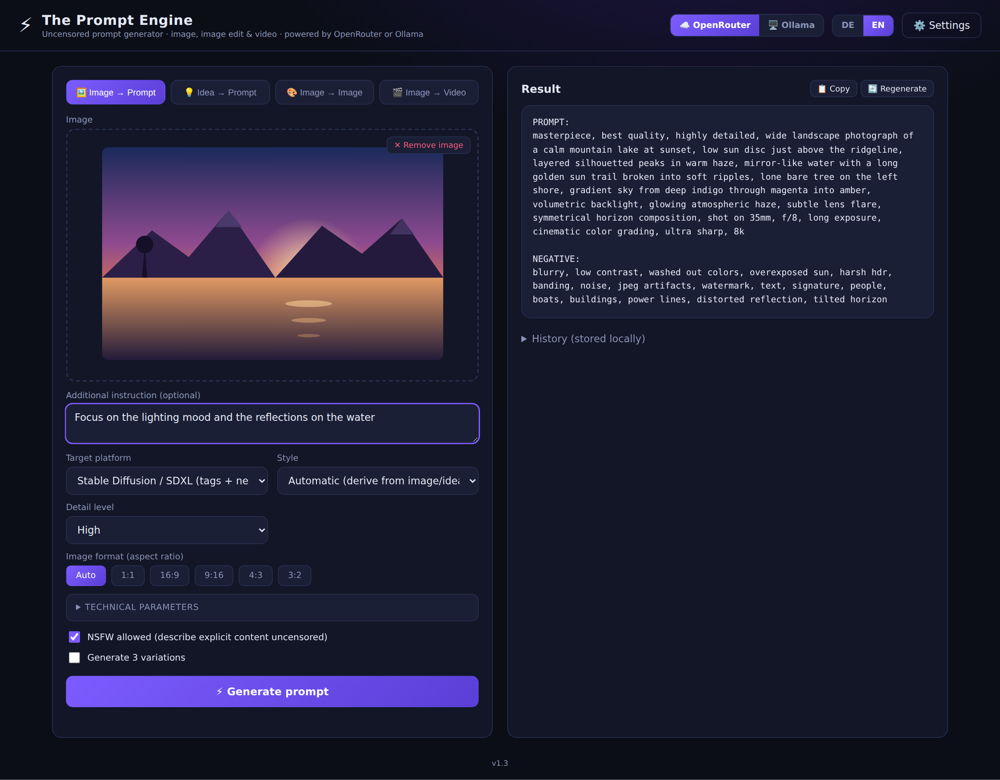
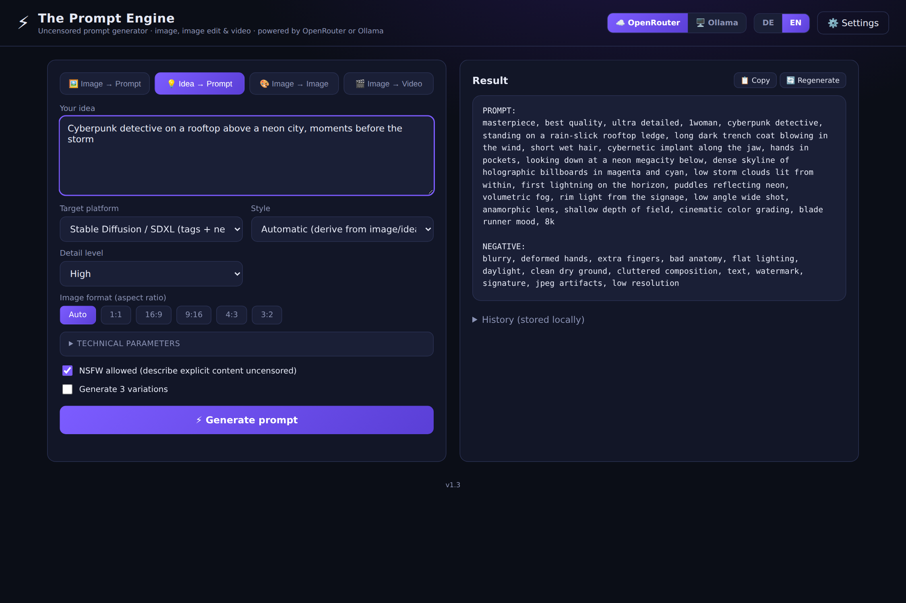
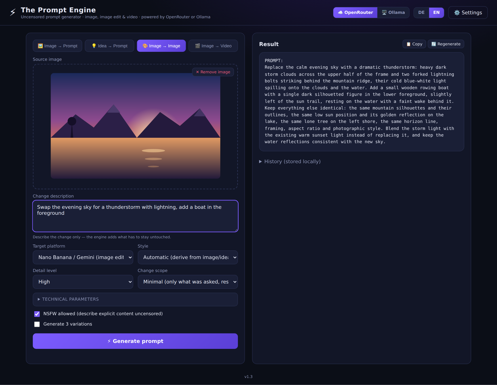
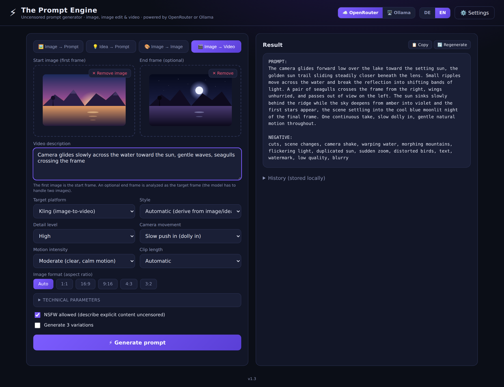

# ⚡ The Prompt Engine — Uncensored (OpenRouter & Ollama Edition)

*[Deutsche Version](README.de.md)*

Functional rebuild of *thepromptengine.midnightlabai.com* — without its fatal flaw:
the original hardcoded `gemini-2.5-flash` in its frontend bundle; after Google retired
that model for new API accounts, every new key ran into a 404.

This clone uses **freely selectable vision models** instead — no model is hardcoded,
and the model list is loaded at runtime. Switchable between two providers:

- **OpenRouter** (cloud) — huge model catalog, API key required, costs per request.
- **Ollama** (local) — runs on your own machine: no API key, no cost, and no image
  ever leaves your computer.

The switch sits in the top-right header (☁️ OpenRouter / 🖥️ Ollama) and in
⚙️ Settings. Model, API key, and Ollama address are stored per provider, so
switching back and forth never loses a setting.

## Features

- **Image → Prompt**: Upload an image (drag & drop, click, or Ctrl+V); a vision LLM
  analyzes it and produces a detailed generation prompt.
- **Idea → Prompt**: Enter a short idea and the engine expands it into a professional
  prompt.
- **Image → Image**: Upload a source image and describe in words what should change —
  out comes a ready-to-use edit prompt for image-editing models. The **change scope**
  (minimal / moderate / strong) controls how much may change alongside the requested
  edit; on "minimal" the engine spells out what has to be preserved (identity, pose,
  background, lighting, framing) in the prompt itself.
- **Image → Video**: Upload a start image, optionally an **end frame** as the target
  frame, and describe what should happen in the clip — out comes an image-to-video
  prompt. Also selectable: camera movement (dolly, pan, orbit, crane, handheld …),
  motion intensity (subtle / moderate / dynamic) and clip length.
- **Target platforms**, per mode:
  - *Image/Idea → Prompt*: SDXL (tags + negative prompt), Pony/Illustrious (booru tags
    incl. score/rating tags), Flux (prose), Midjourney (incl. `--ar`/`--stylize`),
    DALL-E, Ideogram, Nano Banana/Gemini, Qwen-Image (with text rendering), Krea 2
    (photorealistic), universal.
  - *Image → Image*: Nano Banana/Gemini, Flux.1 Kontext, Qwen-Image-Edit,
    Seedream/SeedEdit, GPT-Image/DALL-E edit, SD/SDXL img2img + inpainting (with a
    denoise recommendation and the region to mask), universal.
  - *Image → Video*: Kling, Runway Gen-4, Google Veo 3 (with audio description),
    Hailuo/MiniMax, Luma Dream Machine/Ray, Wan 2.2, Sora 2, Seedance, universal.
- **Image formats**: Aspect-ratio selection as in the original (Auto, 1:1, 16:9, 9:16,
  4:3, 3:2) — emitted as `--ar` for Midjourney, with a matching resolution
  recommendation for SDXL/Pony. **Image → Image** drops the choice: there the source
  image dictates the format.
- **Technical parameters** (as in the original, collapsible): Logic Mode, Camera Angle,
  Shot Type, Perspective, Composition, Lighting, Atmosphere, Mood, Emotion — each with
  the same value lists as Midnight LAB v2.0.
- **Bilingual**: Language switch (DE/EN) in the top right; the choice is remembered.
- **Options**: Style preset, detail level, 3-variation mode, streaming output, copy
  button, local history.
- **Uncensored**: NSFW toggle — explicit images are analyzed directly and without
  euphemisms. The recommended default models (Qwen3-VL family) run on unmoderated
  OpenRouter endpoints; running locally via Ollama, only the model itself decides.
  Hard limits always stay active: no depictions of minors, no sexual content
  involving real, identifiable people.
- **No backend**: Pure static frontend. The API key stays in the browser's
  localStorage and is sent exclusively and directly to `openrouter.ai` — or, with
  Ollama, to your own machine.

## Screenshots

The four modes in the interface. Source images, inputs, and results are
illustrative examples — in actual use the prompts come from the selected model.

### 🖼️ Image → Prompt

Upload an image, optionally add an extra instruction — out comes a generation
prompt in the format of the chosen target platform (SDXL with a negative prompt
here).



### 💡 Idea → Prompt

No image needed: a short idea is enough, and the engine expands it into the full
prompt. The image area disappears; every other option stays.



### 🎨 Image → Image

A source image plus a change description yields an edit prompt. This mode adds
the **change scope**; the aspect-ratio selection is gone because the source image
dictates the format.



### 🎬 Image → Video

Start image, optional end frame as the target frame, and the video description —
plus camera movement, motion intensity, and clip length.



## Usage

1. Start the page:
   - **Windows**: double-click `start.bat`. It checks whether Ollama is running
     and starts it if needed, picks a free port, starts the server in the right
     folder, and opens the browser.
   - **macOS / Linux**: `python3 serve.py` in the project folder — same thing.
   - To skip the Ollama check: `start.bat --no-ollama` / `python3 serve.py --no-ollama`.
   - **By hand**: `python3 -m http.server 8080` **in the folder holding
     `index.html`**, then open `http://localhost:8080`.

   For Ollama the page has to come from `localhost`. Hosting it on GitHub Pages /
   Netlify works with OpenRouter only — see Option B.
2. Pick a provider in the top-right header and set it up under **⚙️ Settings**
   (see below).
3. Pick a mode at the top left, upload an image or enter an idea →
   **⚡ Generate prompt**.

### Option A: OpenRouter (cloud)

1. Create an API key at [openrouter.ai/keys](https://openrouter.ai/keys).
2. Enter the key under **⚙️ Settings** and pick a vision model.

### Option B: Ollama (local)

1. [Install Ollama](https://ollama.com/download) and pull a vision model:
   ```bash
   ollama pull qwen2.5vl:7b
   ```
2. Start Ollama (`ollama serve`, or just leave the app/service running).
3. **Open this page over `http://localhost`** — easiest via `start.bat` (Windows)
   or `python3 serve.py` (macOS/Linux).
4. Switch to **🖥️ Ollama** in the header. **⚙️ Settings** holds the address
   (default `http://localhost:11434`); **🔄 Load model list** shows every installed
   model, split into "with image support" and "text only".

That's all: Ollama already allows requests from `localhost`, `127.0.0.1` and
`0.0.0.0` on **any port** out of the box. `OLLAMA_ORIGINS` is only needed when the
page runs at some other address — see below.

**When the page isn't served from localhost**

- **Served over https (e.g. GitHub Pages)**: the browser blocks the call to
  `http://localhost:11434` as mixed content before Ollama is ever asked. **No**
  Ollama setting fixes this — the page has to run locally over `http://localhost`.
- **Opened by double-click (`file://`)**: the browser sends origin `null`, which
  Ollama rejects. Again: serve it from a local server.
- **Some other address, e.g. a LAN IP**: only then does the origin need to be
  allowed explicitly:
  ```bash
  OLLAMA_ORIGINS='http://192.168.1.50:8080' ollama serve
  ```

**Setting environment variables persistently**

They must reach the **server process**, not the shell you run `ollama run` in —
restart Ollama afterwards:

```powershell
# Windows: quit Ollama from the tray icon, then
setx OLLAMA_CONTEXT_LENGTH "8192"
```
```bash
# macOS (app): does not survive a reboot
launchctl setenv OLLAMA_CONTEXT_LENGTH "8192"
```
```bash
# Linux (systemd): sudo systemctl edit ollama.service
[Service]
Environment="OLLAMA_CONTEXT_LENGTH=8192"
```

**Further notes**

- **Image → Prompt**, **Image → Image** and **Image → Video** need a multimodal model
  (`qwen2.5vl`, `llava`, `minicpm-v`, `llama3.2-vision`, `gemma3`). Text-only models
  work in **Idea → Prompt** mode only.
- The optional **end frame** in **Image → Video** sends two images in one request. Not
  every model handles multiple images equally well; if the model ignores the second
  one, drop the end frame and state the target state in the video description instead.
- Keep `OLLAMA_CONTEXT_LENGTH` at 8192 or above: image tokens plus the long system
  prompt otherwise overflow the default context window and the start of the prompt
  gets truncated.
- If access still fails, the error message in ⚙️ Settings names the actual cause
  (mixed content, `file://`, foreign origin, or service unreachable). Note that
  opening `http://localhost:11434` in the address bar proves nothing — that request
  carries no origin for the browser to check.

## Model notes

- **OpenRouter**, for uncensored analysis: **Qwen3 VL 235B / 30B / 32B** or
  **Qwen2.5 VL 72B** (unmoderated endpoints, cheap). Grok is also fairly permissive.
- **Ollama**, local: **qwen2.5vl:7b** (~6 GB, fast, barely moderated),
  **qwen2.5vl:32b** (best quality, ~21 GB VRAM), **llava:13b**, **minicpm-v:8b**
  (lightweight). `llama3.2-vision` and `gemma3` work well but are noticeably more
  moderated.
- GPT, Claude, and Gemini models work for SFW content but usually refuse NSFW images.
- If a model ever becomes unavailable (the original's bug), just pick another one in
  the settings — or enter any model ID by hand.

## Legal

For adult users only. When using the cloud, the terms of use of OpenRouter and of
the respective model provider continue to apply and are the user's responsibility.
When running locally via Ollama, the licenses of the pulled models apply.
